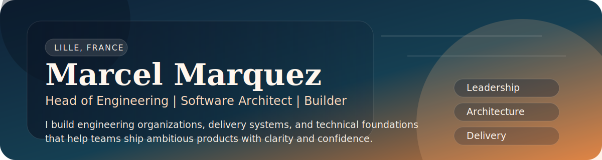
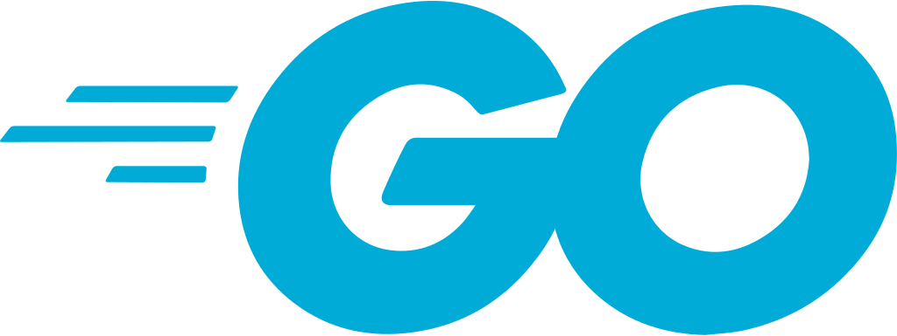
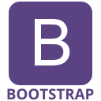

  

  
  &nbsp;
  

  <strong>Head of Engineering</strong>

  I lead engineering organizations and stay close to architecture, delivery, and the systems that turn strategy into shipped product.

  
  
  
  

> I care about clear operating models, dependable platforms, and teams that can move fast without creating chaos.

<table>
  <tr>
    <td width="50%" valign="top">
      <h3>Current Focus</h3>
      <ul>
        <li>Lead engineering organizations with strong accountability, healthy rituals, and practical coaching.</li>
        <li>Shape maintainable platforms, APIs, and distributed systems that support product scale.</li>
        <li>Bridge strategy and execution through architecture decisions, delivery oversight, and hands-on problem solving.</li>
      </ul>
    </td>
    <td width="50%" valign="top">
      <h3>How I Work</h3>
      <ul>
        <li>Turn ambiguity into simple plans, crisp interfaces, and measurable outcomes.</li>
        <li>Balance speed, resilience, and maintainability instead of optimizing only one dimension.</li>
        <li>Build ownership through pragmatic quality standards, useful feedback loops, and calm execution.</li>
      </ul>
    </td>
  </tr>
</table>

## Snapshot

| Topic | Details |
| :--- | :--- |
| Based in | Lille, France |
| Current role | Head of Engineering at Adeo |
| Strengths | Leadership, architecture, product engineering |
| Building with | Java, JavaScript, Node.js, Go, cloud platforms |
| Favorite problems | Scaling teams, untangling architecture, raising engineering quality |

## Selected Work

| Project | Why it matters |
| :--- | :--- |
| [`spring-ai-mcp-server-demo`](https://github.com/Ramzus/spring-ai-mcp-server-demo) | A practical Java and Spring example for MCP servers and agentic AI workflows; useful for showing how I explore emerging platform patterns with production-minded structure. |
| [`spring-ai-openai-demo`](https://github.com/Ramzus/spring-ai-openai-demo) | A focused sandbox for OpenAI integration with Spring, built around experimentation that stays grounded in real engineering concerns. |
| [`liquibase-mongodb`](https://github.com/Ramzus/liquibase-mongodb) | A small but pragmatic containerized setup for MongoDB migrations, reflecting my bias toward operable developer tooling and clean delivery pipelines. |
| [`draws`](https://github.com/Ramzus/draws) | A lightweight repository for architecture diagrams, included because communication and system design are as important as code. |

## Experience Arc

| Role | Company |
| :--- | :--- |
| **Head of Engineering** | **Adeo** |
| Engineering Manager | Leroy Merlin France |
| Software Architect & Tech Leader | Adeo |
| Solution Architect & Tech Leader | Nexity |
| Solution Architect & Tech Leader | Sopra |
| Developer | Inetum (GFI) |

## Toolbox

  
  &nbsp;&nbsp;
  
  &nbsp;&nbsp;
  
  &nbsp;&nbsp;
  
  &nbsp;&nbsp;
  
  &nbsp;&nbsp;
  
  &nbsp;&nbsp;
  
  &nbsp;&nbsp;
  
  &nbsp;&nbsp;
  
  &nbsp;&nbsp;
  

| Domain | Stack |
| :--- | :--- |
| Backend | `Java` `Node.js` `Go` `NestJS` |
| Frontend | `JavaScript` `Vue` `HTML` `CSS` `Bootstrap` |
| Data and platform | `PostgreSQL` `MongoDB` `Kubernetes` `AWS` `GCP` `Git` |

